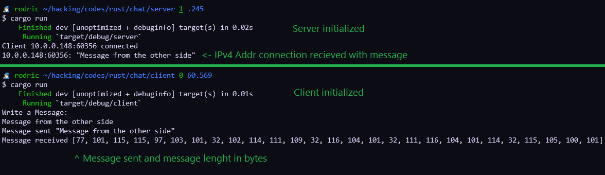

# Rust RX & TX TCP Connection
TCP Server -> Client (accepts multiple clients) Chat Connection with Rust <br>

- On Server console, start the server first:
```bash
~/chat/server/ $ cargo run
```

- On Client console:
```bash
~/chat/client/ $ cargo run
```

<br>

- Practical example:
<p align="center">
  
</p>

<br>

- Source:
[Tensor](https://youtu.be/CIhlfJSvxe4)
